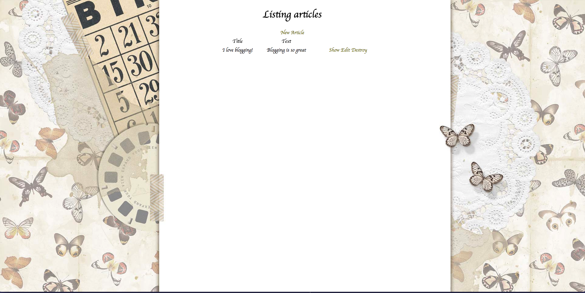

# README

This README would normally document whatever steps are necessary to get the
application up and running.

This is pretty much my first time working with Rails, so I followed the tutorial and then added a tiny bit of styling to make it more blog-like. Wish I had more time to work on it! 

